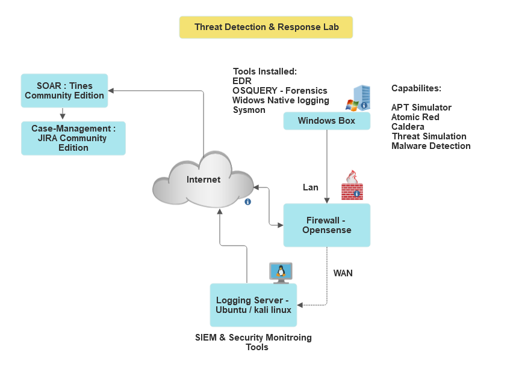
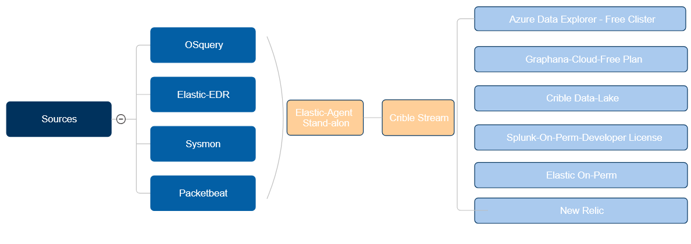

# Threat Detection & Response Lab (TDAR)

  

Threat Detection & Response Lab (TDAR) offers a modular and scalable environment for security professionals to deploy, test, and analyze a variety of security tools and technologies. By leveraging modern infrastructure components like Docker, TDAR simplifies the deployment, management, and integration of cutting-edge security solutions.

## Lab Diagram

  

## Lab Infrastructure Diagram

  

The diagram above illustrates the architecture of the TDAR environment, showcasing the key components:

- **Sources**: These include tools like OSQuery, Elastic-EDR, Sysmon, Packetbeat, and Windows Native Logging, which feed data into the system.
- **Monitoring and Aggregation**: Elastic-Agent (stand-alone) and Crible Stream handle the management and processing of data collected from the sources.
- **Output Tools**: Data is then visualized and analyzed using tools such as Azure Data Explorer, Graphana (Cloud), Splunk (On-prem), and Elastic (On-prem).

### Key Elements:
1. **Sources**:
   - OSQuery
   - Elastic-EDR
   - Sysmon
   - Packetbeat
   - Windows Native Logging

2. **Monitoring & Data Ingestion**:
   - Elastic-Agent (Stand-Alone)
   - Crible Stream

3. **Output & Analysis**:
   - Azure Data Explorer
   - Graphana (Cloud)
   - Splunk (On-prem)
   - Elastic (On-prem)

Each component in the architecture has been carefully selected to ensure maximum coverage of threat detection and incident response capabilities.

## Capabilities

- **Streamlined Deployment**: Docker and Docker Compose provide fast and efficient setup for all lab components.
- **Scalable & Flexible**: Easily customize the lab environment with a variety of security tools based on specific testing or research needs.
- **Comprehensive Tool Integration**: Integrates leading security solutions such as Splunk, Elastic SIEM, Cribl, n8n SOAR, and Shuffle for diverse use cases.
- **Hands-on Security Testing**: Simulate real-world scenarios including threat detection, incident response, and threat hunting exercises.

## System Architecture

### Components
- **Firewall (opnSense)**: To ensure isolation and enforce firewall rules.
- **Windows Box**: Native logging, Sysmon, OSQUERY, and forensic tools for endpoint security.
- **Logging Server (Ubuntu)**: Acts as the SIEM with tools like Splunk, Elastic SIEM, and security monitoring software.
- **SOAR (Tines Community Edition)**: Security orchestration for automation and response.
- **Case Management (JIRA Community Edition)**: Tracks and manages incidents and responses.

## Key Takeaways
- Administration of production-grade tools.
- Mastery of configuration management.
- Building and understanding logs & data structures.
- Creating custom threat detection queries.
- Visualization and data analytics using leading platforms.
- Developing and refining threat hunting skills.
- Integration with multiple platforms for streamlined workflows.

## Tooling

- **EDR (Elastic EDR)**: Endpoint Detection and Response.
- **OSQUERY**: Host-based analytics tool to identify anomalies and queries across endpoints.
- **Sysmon**: Monitors and logs system-level events for detailed insights.
- **Logging**: Windows native logging, Sysmon, and Packetbeat.
- **Cribl Stream**: Manage and route data to multiple destinations.
- **Splunk**: Data analytics platform for monitoring and searching machine data.
- **Elastic SIEM**: SIEM solution for threat detection and incident response.
- **Atomic Red Team**: For threat simulation and adversary emulation.
- **Caldera**: Automated adversary emulation system to run penetration tests.

## System Requirements

- **Docker** (for containerized deployments)
- **Docker Compose** (to manage multi-container applications)
- **Bash shell** (for automation and management scripts)
- **Internet Access** (for integrating external sources like JIRA, Tines, and other cloud-based services)

## Integrated Solutions

- **Splunk**: Real-time data monitoring, search, and analytics platform with powerful querying capabilities.
- **Elastic SIEM**: Elastic Stack-powered SIEM for managing security events, logs, and incidents.
- **Cribl Stream**: Log routing and observability pipeline for centralized management of security data.
- **n8n SOAR**: Open-source automation tool for orchestrating security operations workflows.
- **Shuffle**: SOAR platform focused on automating and streamlining security processes.

## Configuration Options

TDAR supports both cloud-based and on-premises deployments for data management and analysis. Choose from:

- **Elastic Agent Standalone**: Centralized logging and monitoring solution using the Elastic Stack.
- **Cribl Stream**: Integrate with multiple data destinations for easy management and scalability.
- **Logstash/Kafka**: Robust data pipeline solutions for high-volume log ingestion and real-time analysis.
- **Splunk (On-Prem)**: Install Splunk locally to leverage full control over ingestion limits, data retention, and analytics.
- **Cloud Destinations**: Integrate with Azure Data Explorer, Grafana, or Elastic Cloud for scalable storage and visualization.

## Usage Scenarios

- **Incident Response**: Test and refine your incident response playbooks.
- **Threat Hunting**: Leverage powerful SIEM and EDR capabilities to detect and hunt for advanced threats.
- **Threat Simulation**: Simulate APT attacks and malware detonation using tools like Atomic Red Team and Caldera.
- **Log Analysis & Visualization**: Visualize data trends and insights using Grafana, Splunk, or Elastic Dashboards.

## Credits

This project was inspired and built upon resources from [sakshamtushar](https://github.com/sakshamtushar). Many thanks for the contributions and ideas shared in the community.
